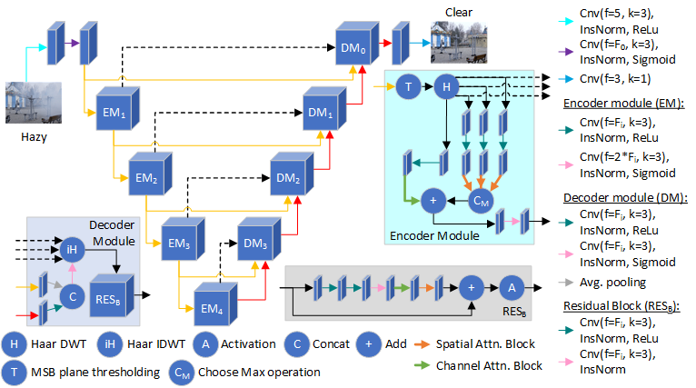
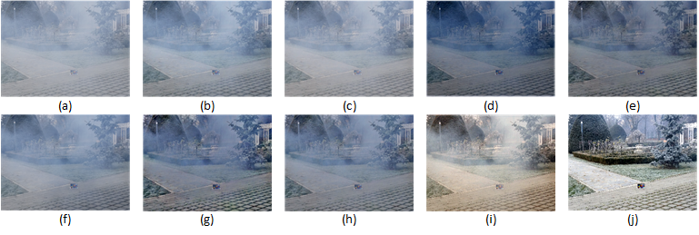
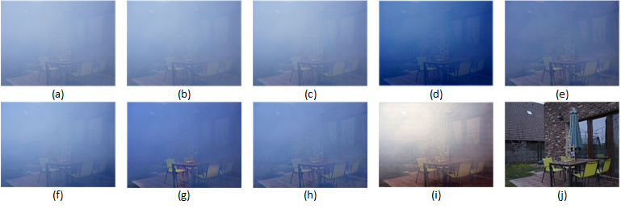

# Haar wavelets-based attention network for image dehazing
by [Sumit Laha](https://www.cs.ucf.edu/~laha/) and [Hassan Foroosh](https://cil.cs.ucf.edu/people/faculty/)
The original article can be found at [].
## Framework

## Qualitative analysis
- Qualitative analysis on NH-Haze dataset - (a) Hazy image, (b) DehazeNet, (c) MSCNN, (d) AOD-Net, (e) AMEF, (f)
GridDehazeNet, (g) PADMEF, (h) FMEF, (i) Proposed and (j) Ground-truth: 
- Qualitative analysis on Dense-Haze dataset - (a) Hazy image, (b) DehazeNet, (c) MSCNN, (d) AOD-Net, (e) AMEF, (f)
GridDehazeNet, (g) PADMEF, (h) FMEF, (i) Proposed and (j) Ground-truth:

## Quantitative analysis
<table>
<thead>
  <tr>
    <th rowspan="2">Methods</th>
    <th colspan="2">NH-Haze</th>
    <th colspan="2">Dense-Haze</th>
  </tr>
  <tr>
    <th>PSNR</th>
    <th>SSIM</th>
    <th>PSNR</th>
    <th>SSIM</th>
  </tr>
</thead>
<tbody>
  <tr>
    <td>DehazeNet</td>
    <td>12.4718</td>
    <td>0.3519</td>
    <td>10.9446</td>
    <td>0.2198</td>
  </tr>
  <tr>
    <td>MSCNN</td>
    <td>12.241</td>
    <td>0.3752</td>
    <td>10.1727</td>
    <td>0.234</td>
  </tr>
  <tr>
    <td>AOD-Net</td>
    <td>12.1721</td>
    <td>0.4451</td>
    <td>12.4402</td>
    <td>0.3921</td>
  </tr>
  <tr>
    <td>AMEF</td>
    <td>13.9542</td>
    <td>0.4466</td>
    <td>13.5156</td>
    <td>0.2577</td>
  </tr>
  <tr>
    <td>GridDehazeNet</td>
    <td>12.4803</td>
    <td>0.4838</td>
    <td>11.0879</td>
    <td>0.3648</td>
  </tr>
  <tr>
    <td>PADMEF</td>
    <td>13.5472</td>
    <td>0.447</td>
    <td>13.3676</td>
    <td>0.2441</td>
  </tr>
  <tr>
    <td>FMEF</td>
    <td>13.4027</td>
    <td>0.4456</td>
    <td>12.7601</td>
    <td>0.2437</td>
  </tr>
  <tr>
    <td>Proposed</td>
    <td>15.3546</td>
    <td>0.5461</td>
    <td>14.4495</td>
    <td>0.4324</td>
  </tr>
</tbody>
</table>

## Libraries required
- tensorflow
- tensorflow_addons
- tensorflow_datasets
- [wavetf](https://github.com/fversaci/wavetf)
## Train

## Test